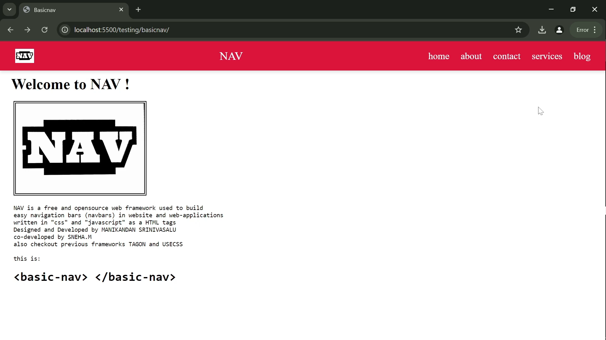
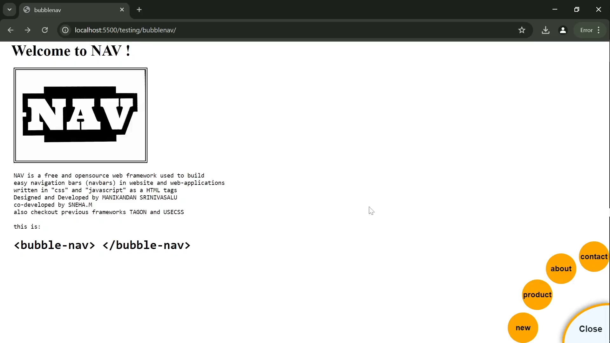
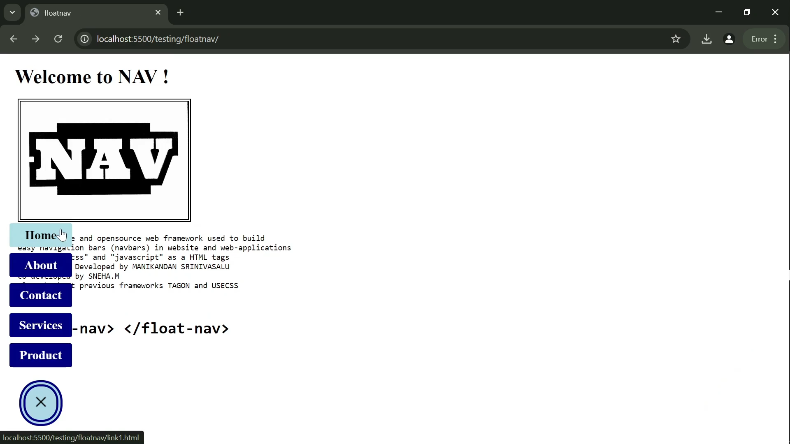
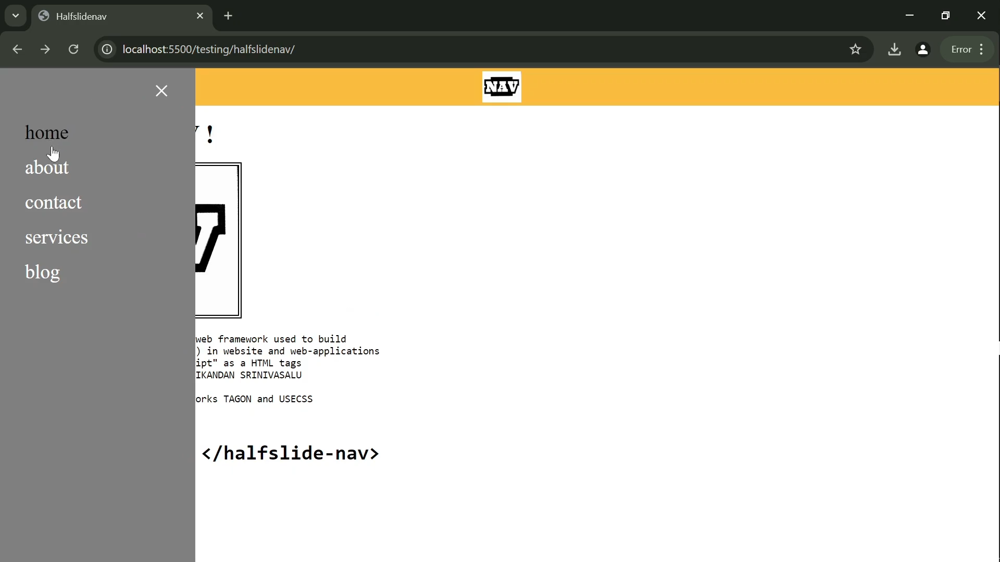
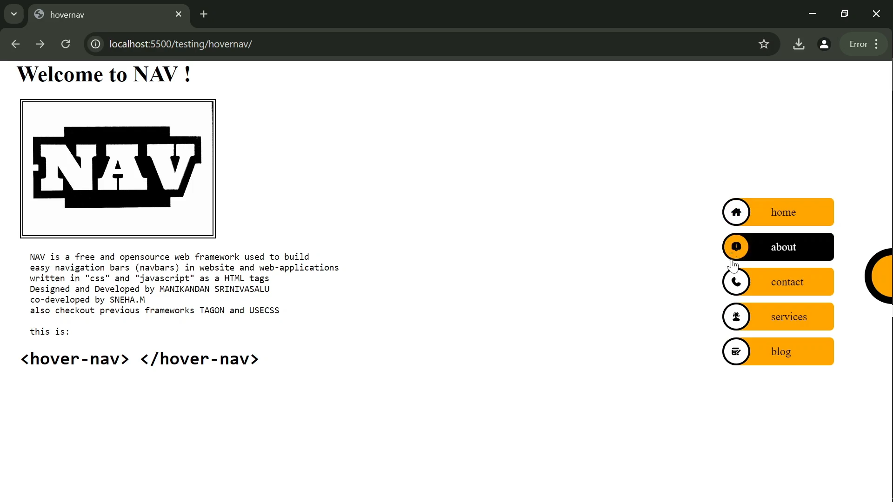
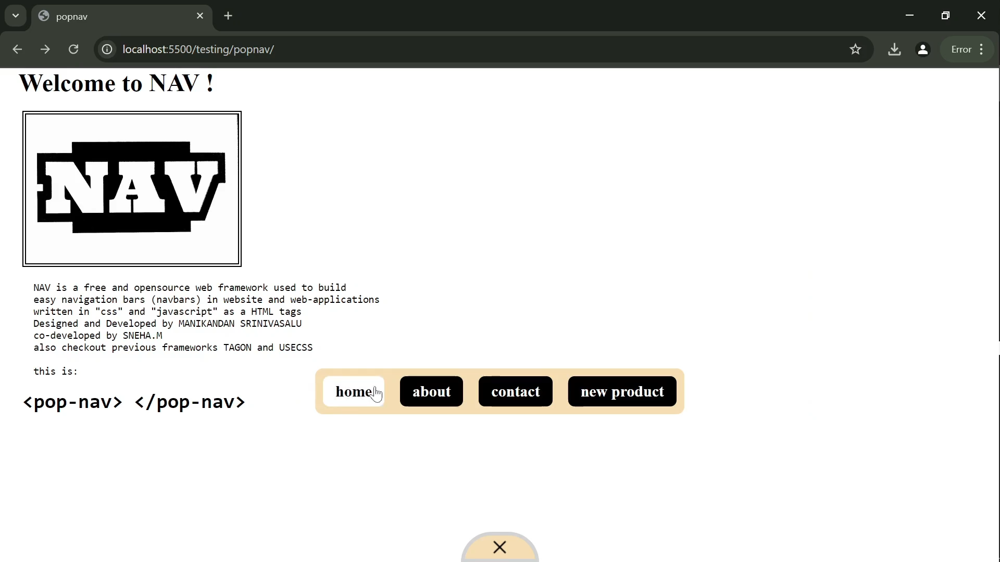
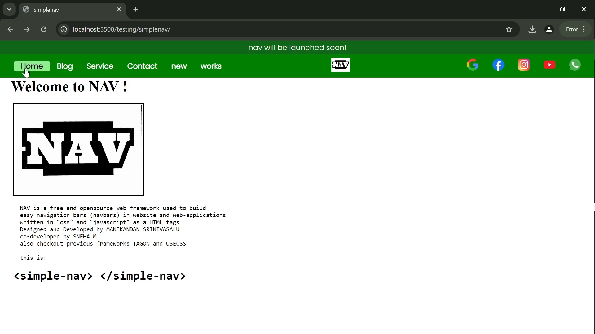
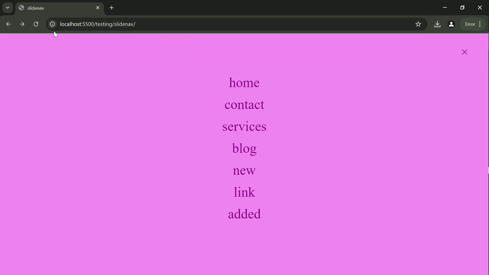

# Welcome to NAV 
<div style="display:flex;">

<h4 style="margin-top:10px;"> NAV is a free and opensource web framework used to build easy navigation bars (navbars) in website and web-applications written in "css" and "javascript" as a HTML tags</h4> 
</div>

Designed and Developed with ❤ for the devlopers by [MANIKANDAN SRINIVASALU](https://www.linkedin.com/in/manikandansrinivasalu/)

co-developed by [SNEHA.M](https://www.linkedin.com/in/m-sneha-57b284228/) 

# NAV tags

## ! note 
- don't forget to include CDN links of css and js
- try to include all attributes for respective nav
- some nav attributes can handle mutiple values seperated by comma( , ) eg: pages , __styles etc..
- if you dont need any customization you can provide empty attributes eg: direction = ""
## basic-nav



A very basic navbar designed with customization 

| attribute    | value |
| :--------: | :-------: |
| logo  | add your brand image |
| logodim  | dimension Height and Width in px |
| brand  | name/title of your brand |
| brandlink  | link to navigate on click |
| menustyle  | barcolor ,fontcolor, hovercolor |
| pages  | name of the pages(seprate with comma) |
| links  | links for the page(url or.html or file) |
| sticky  | navbar sticks to page on scroll if true else sticky="" |
| transparent | transparent bar that adopts page color|
### code sample of basic-nav

```html
<basic-nav
    logo="../nav.jfif" 
    logodim="30px,40px"
    brand="NAV" 
    brandlink="index.html"
    menustyle="crimson,white,black"
    pages="home,about,contact,services,blog"
    links="link1.html,link2.html,link3.html,link4.html,link5.html"
    sticky="true">
</basic-nav>
```

## bubble-nav


circular menus pops from corner 
### note ! 
bubble-nav can handle only upto "4" menu

| attribute    | value |
| :--------: | :-------: |
| color  | color of the bubbles |
| hovercolor  | color on hover |
| bubbletext-color | font color  |
| bubbleborder | changes the bordercolor of bubble |
| font  | font family of your choice |
| pages  | name of the pages(seprate with comma) |
| links  | links for the page(url or.html or file) |
| bubble1-x  | the x position of the bubble 1 in px|
| bubble1-y  | the y position of the bubble 1 in px|
| bubble2-x  | the x position of the bubble 2 in px|
| bubble2-y  | the y position of the bubble 2 in px|
| bubble3-x  | the x position of the bubble 3 in px|
| bubble3-y  | the y position of the bubble 3 in px|
| bubble4-x  | the x position of the bubble 4 in px|
| bubble4-y  | the y position of the bubble 4 in px|
| menucolor | color of the menu button in corner |
| menutext-color | font color of menu button|
| menuborder | use css border eg: 2px solid red|
### code sample of bubble-nav

```html
 <bubble-nav 
    pages="contact,about,product,new" 
    links="contact.html,about.html" 
    color="orange" 
    hovercolor="grey" 
    bubbletext-color="black" 
    bubbleborder="red" 
    font="arial">
</bubble-nav>
```

## float-nav



float nav is like floating icon button which can hold upto 6 menu

the side of the icon and position can also be changed but not the menus 

| attribute | value |
| :--------: | :-------: |
| openicon  | image eg:hamburgericon |
| closeicon  | image eg:closeicon |
| fontstyle  | fontcolor, hovercolor |
| posx,posy  | icon position x,y for mobile view |
| posxpc,posypc  | icon position x,y for pc view |
| menubtnstyle | color,css border property, roundness in (%) |
| menustyle | color,hovercolor,clickcolor,roundness in (px)|
| pages  | name of the pages(seprate with comma) |
| links  | links for the page(url or.html or file) |
| right | sticks to rightside if right="true" |
### code sample of float-nav

```html
   <float-nav
    openicon="images/hamburger.png"
    closeicon="images/exit.png"
    fontstyle="white,black"
    posx="-5px" posy="1px"
    posxpc="-4px" posypc="0px"
    menubtnstyle="lightblue,10px double navy,46%"
    menustyle="navy,powderblue,red,3px"
    pages="Home,About,Contact,Services,Product"
    links="link1.html,link2.html,link3.html,link4.html,link5.html">
  </float-nav>
```

## halfslide-nav



halfslide nav provides the classic website navigation of sliding effect

| attribute | value |
| :--------: | :-------: |
| slideicon  | image that opens menu eg:hamburgericon |
| icon  | add your brand image |
| logodim  | dimension Height and Width in (px) |
| barcolor | color of the navbar |
| slidecolor | color of the slide |
| fontstyle  | fontcolor, hovercolor |
| pages  | name of the pages(seprate with comma) |
| links  | links for the page(url or.html or file) |
| right | slides from rightside if right="true" |
### code sample of halfslide-nav

```html
<halfslide-nav 
    slideicon="images/hamburger.png" 
    icon="../nav.jfif"
    logodim="40px,50px"
    barcolor="#FABC3F"
    slidecolor="grey"
    fontstyle="white,black"
    page="home,about,contact,services,blog" 
    links="link1.html,link2.html,link3.html" 
    right="">
</halfslide-nav>
```

## hover-nav



hover nav provides the classic website navigation of sliding effect

| attribute | value |
| :--------: | :-------: |
| pages  | name of the pages(seprate with comma) |
| links  | links for the page(url or.html or file) |
| imageicons | icons for your menu(seprate with comma) try to give it as per the order of the pages |
| menubtncolor | color of the menu button |
| menubtnborder | css border property |
| menustyle  | menucolor, hovercolor |
| iconstyle  | icon background color, hovercolor |
| fontstyle  | fontcolor, hovercolor |
| iconborder  | css border property |
| openicon  | image eg:hamburgericon |
### code sample of hover-nav

```html
<hover-nav 
    pages="home,about,contact,services,blog" 
    links="link1.html,link2.html,link3.html" 
    imageicons="images/home.png,images/about.png,images/contact.png,images/service.png,images/blog.png"
    menubtncolor="orange" 
    menubtnborder="10px solid black"
    menustyle="orange,black"
    iconstyle="white,orange"
    fontstyle="black,white"
    iconborder="3px solid black">
</hover-nav> 
```

## pop-nav



pop nav is like a popup which can hold upto 6 menu


| attribute | value |
| :--------: | :-------: |
| openicon  | image eg:hamburgericon |
| closeicon  | image eg:closeicon |
| btncolor | color of navbutton |
| btnborder | css border property |
| menustyle | bar background color, menucolor, hovercolor, activecolor|
| fontstyle  | fontcolor, hovercolor |
| pages  | name of the pages(seprate with comma) |
| links  | links for the page(url or.html or file) |
### code sample of pop-nav

```html
<pop-nav
    openicon="images/hamburger.png" 
    closeicon = "images/exit.png"
    btncolor="wheat" 
    btnborder = "5px solid lightgrey"
    menustyle = "wheat,black,white,"
    fontstyle="white,black"
    pages="home,about,contact,new product" 
    links="link1.html,link2.html,link3.html">
</pop-nav>
```

## simple-nav



simple nav is general nav with msg feature and icons 

| attribute | value |
| :--------: | :-------: |
| msg | message to be displayed on top of the navbar |
| msgcolor | background color,fontcolor |
| navbarcolor | bar background color, fontcolor, menuhovercolor, fonthovercolor|
| pages  | name of the pages(seprate with comma) |
| links  | links for the page(url or.html or file) |
| logo  | add your brand image |
| logodim  | dimension Height and Width in (px) |
| icons | icons for your socialmedia(seprate with comma)|
| iconlinks  | links for the page(url) |
| iconhovercolor  | hovercolor on the icons |
### code sample of simple-nav

```html
<simple-nav
    msg="nav will be launched soon!"
    msgcolor=",white"
    navbarcolor="green,white,lightgreen,black"
    pages = "Home,Blog,Service,Contact,new,works"
    links ="../index.html,../about.html,link3.html,link4.html"
    logo = "../nav.jfif"
    logodim="30px,40px"
    icons="images/gg.png,images/fb.png,images/ig.png,images/yt.png,images/wt.png"
    iconlinks="https://www.google.com,,link3.html,https://www.youtube.com,link4.html"
    iconhovercolor="lightgreen">
</simple-nav>
```

## slide-nav



slide nav provides the classic website navigation of sliding effect

| attribute | value |
| :--------: | :-------: |
| logo  | add your brand image |
| logodim  | dimension Height and Width in (px) |
| barcolor | color of the navbar |
| fontstyle  | fontcolor, hovercolor |
| slidecolor | color of the slide |
| slideicon  | image that opens menu eg:hamburgericon |
| pages  | name of the pages(seprate with comma) |
| links  | links for the page(url or.html or file) |
| direction | slides from direction[top,bottom,left,right] |
### code sample of slide-nav

```html
  <slide-nav
    logo="../nav.jfif"
    logodim="40px,60px"
    barcolor="purple"
    fontstyle="purple,white"
    slidecolor="violet"
    slideicon="images/hamburger.png"
    page="home,contact,services,blog,new,link,added"
    links="link1.html,link2.html,link3.html,link4.html,link5.html"
    direction="left">
  </slide-nav>
```
thank you!
